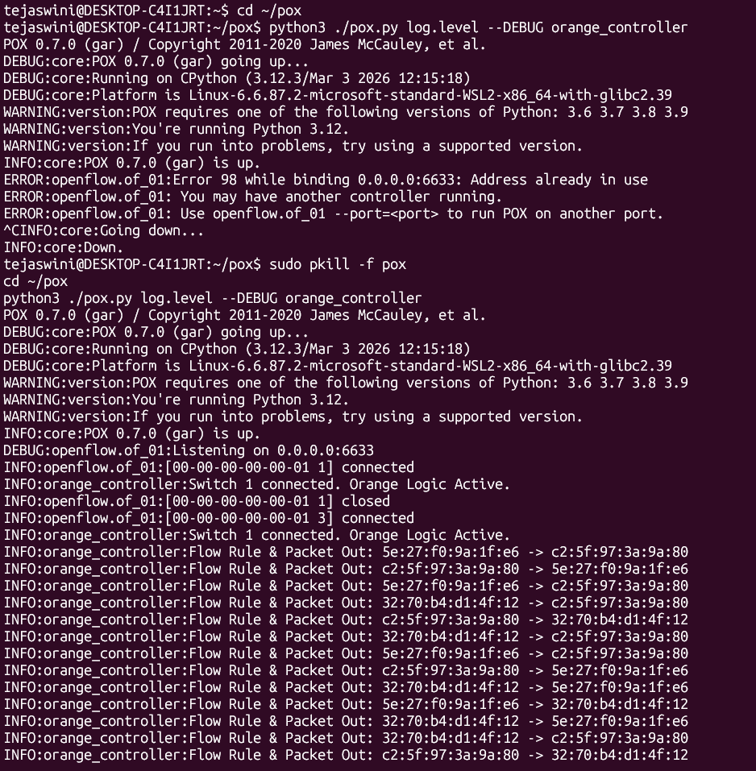
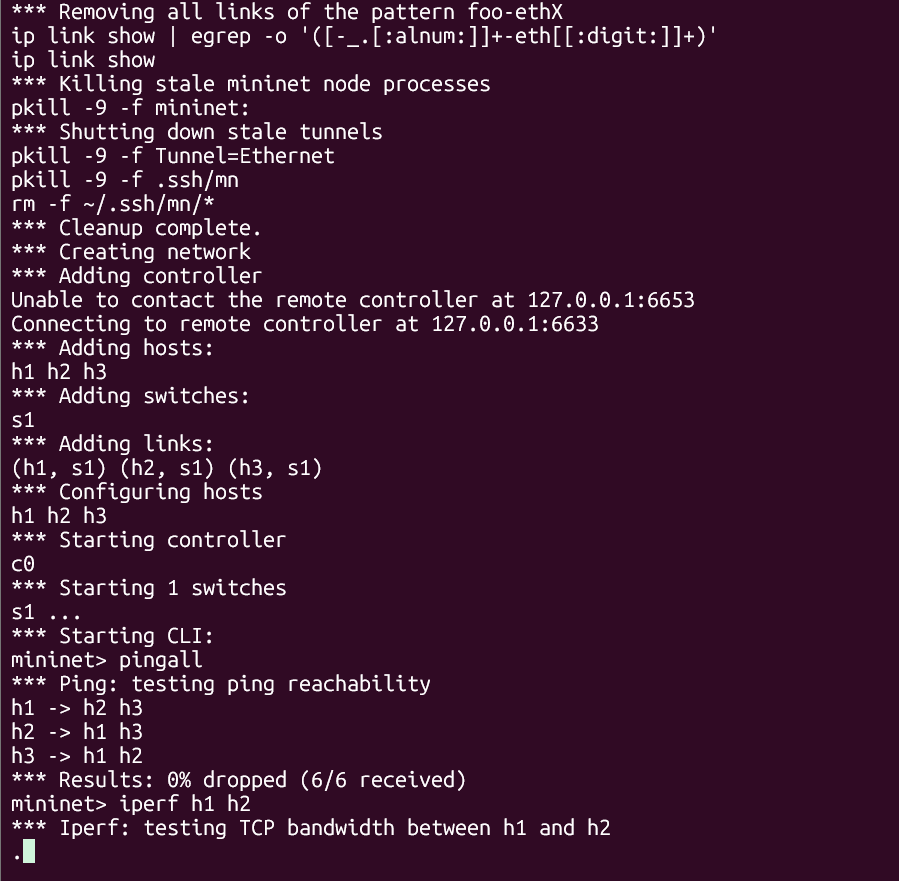
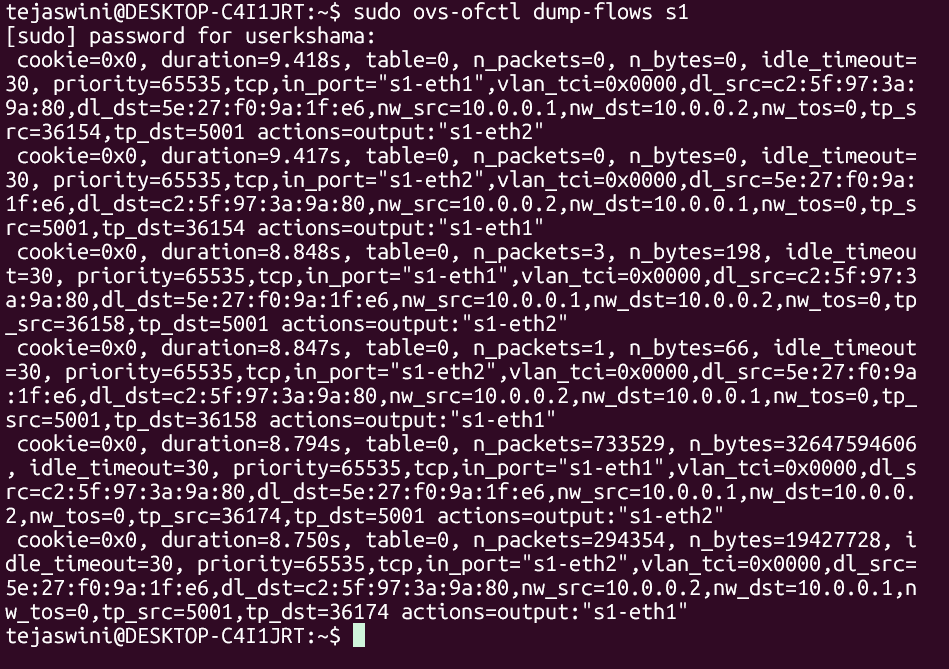

# SDN Implementation: The Orange Problem

Software-Defined Networking (SDN) solution using the **POX Controller** and **Mininet**. The project implements a custom star topology and a reactive learning switch logic that manages network traffic through OpenFlow v1.0.

## 🚀 Project Overview
The objective was to design a network where a central controller dynamically manages host connectivity. Key features include:
* **Reactive Flow Insertion**: Flow rules are only installed when traffic is detected (`PacketIn` events).
* **MAC Learning**: The controller builds a mapping of MAC addresses to switch ports.
* **Flow Expiry**: Rules include an `idle_timeout=30` to maintain a clean flow table.
* **Performance Validation**: Connectivity and throughput verified using standard networking tools.

## 🛠️ Components
1. **`orange_topo.py`**: A custom Mininet topology script defining 3 hosts connected to a single OpenFlow switch.
2. **`orange_controller.py`**: A Python-based POX controller that implements the learning-switch logic.

---

### 1. Controller Activity & Logic
The controller logs demonstrate successful connection to the switch and the reactive installation of flow rules for every unique host-to-host communication.


### 2. Network Connectivity (pingall) & Performance (iperf)
Full reachability was achieved with **0% packet loss**. Performance testing via `iperf` shows the maximum bandwidth capacity between hosts.


### 3. Switch Flow Table Validation
Using `ovs-ofctl`, we can verify that the controller successfully pushed the match-action rules to the switch hardware. Note the `n_packets` count showing active traffic processing.


---

## 💻 How to Run
To replicate this environment, follow these steps:

1. **Start the POX Controller:**
   ```bash
   python3 ./pox.py log.level --DEBUG orange_controller
2. **Launch the Mininet Topology:**
  ```bash
sudo mn --custom orange_topo.py --topo orangetopo --controller remote,ip=127.0.0.1
```
3. **Verify Flows:**

```bash
sudo ovs-ofctl dump-flows s1
```
